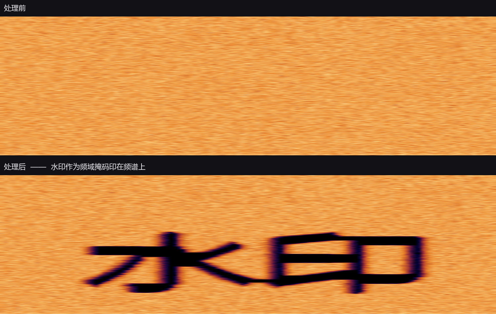
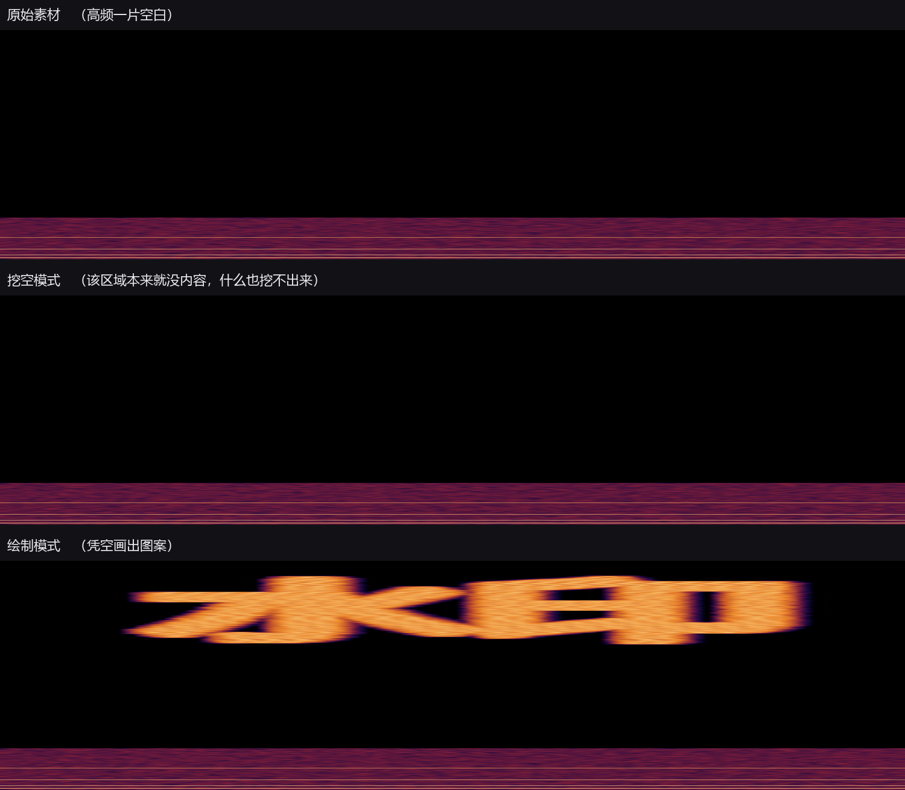

# 频谱水印生成

把图案或文字以**频域掩码**的形式印到音频上 —— 水印会真的"长"在频谱里，用任何频谱分析软件都能看见。在 [SpectrumTag](https://github.com/sweetorange1/SpectrumTag) 的 STFT/OLA 算法基础上，补齐了**批量处理**、**循环印刷**与**文字水印**。

```bash
python run.py          # 或 python -m spectrumtag_batch
```



---

## 功能

| 需求 | 实现 |
| --- | --- |
| 自定义水印图案与尺寸、比例 | 频谱图上拖动黄色印章框即可。**八个手柄**：四角等比缩放（图案不变形），四边分别只调宽度或高度；也可直接键入数值 |
| 文字代替图片图案 | 支持直接输入文字（含中文、多行），可调**粗细**；也可切换为图片模式 |
| 调整在频谱图中的位置 | 拖框，或在右侧直接键入频率（Hz）与时间（秒 / 比例）。默认落在 **9–10.5 kHz**、从 **0** 秒开始，拖框时会浮出 **7–13 kHz** 的推荐印刷区域 |
| 保持原始水印比例（默认开） | 时长按图案长宽比自动反推，图案不被拉伸变形 |
| 图案描边（默认开） | 沿图案外沿再描一圈反向处理，与本体配成**峰谷对**，大幅抬高去除成本 |
| 循环印刷（默认开） | 每隔指定秒数在同样的频段重复印一次，可限定重复上限 |
| 批量处理 | 拖入文件夹或多个音视频文件，一次对所有文件施加同一套水印；也可只处理当前选中的那一个 |

### 衰减 与 注入

这是两种**性质不同**的处理，不只是参数差别：

| | 衰减（CUT） | 注入（DRAW） |
| --- | --- | --- |
| 数学形式 | 乘法增益 `out = in × gain` | 加性注入 `out = in + synth` |
| 效果 | 削弱图案区域，频谱上挖出图形空洞 | 在图案区域造出内容，图案变亮 |
| 空白频段 | **无能为力** —— 空白乘任何系数仍是空白 | **可以** —— 超高频那种原本没内容的地方也能画出图案 |
| 素材本身 | 需要有内容才挖得出来 | 不依赖素材，凭空生成 |
| 风险 | 无 | 频段铺得越宽、强度越高，越容易削波 |

判断依据很简单：想在**已有内容**上做减法就用衰减；想在**空白区域**"画"东西就用注入。



### 印法建议

两种印法各有擅长的频段，把框拖到不合适的位置时程序会提醒一次：

| 情况 | 建议 | 原因 |
| --- | --- | --- |
| 框**主要位于 15 kHz 以上**，当前是衰减 | 改用注入 | 该频段素材能量通常较低，衰减的可操作余量有限，图案不易辨识 |
| 框**主要位于 10 kHz 以下**，当前是注入 | 改用衰减 | 该频段能量集中，注入合成信号会明显改变频谱包络，听感差异较易察觉 |

「主要位于」指框与目标频带的重叠超过其自身跨度的一半 —— 不要求整个框都落进去，
否则稍微越界一点就不提醒，反而会漏掉本该提醒的情况。

弹窗给「立即切换」和「暂不需要」两个选择。**同一首曲目、同一类建议只提一次**（换文件后重新允许），
拖动过程中也不会弹 —— 要等停手约 0.6 秒才判断，免得打断操作。

### 界面交互

- **两块提示带**：一拖动印章框，频谱上就浮出绿色的**推荐印刷区域**（7–13 kHz）
  和黄色的**敏感频段**（20 Hz–5 kHz），停手约一秒后一起收起 —— 它们只是参考，
  不挡着看频谱。

  往下是低频（人耳最敏感、音乐能量也集中，动它最容易听出「变薄」），往上转个码就被低通切掉，
  中间那一段才是水印的落脚点。两条都只是参考线，不是硬限制。

  提示带**只描上下两道边界**，不画左右两条边 —— 它横跨整个时间轴，左右本来就没有边界，
  画出来只是两端各一道扎眼的亮竖条。
- **框内实时显示图案**：拖框时看到的就是最终印上去的形状，所见即所得。
  图案的**颜色和浓淡都跟着参数走** —— 衰减画成暗块（那一片会被抹掉），注入取它在热力色标上
  对应的颜色（强度越高越偏暖橙），不透明度直接映射强度：拖强度滑杆时图案随之变浓变淡。
  第一个框和循环影子用同一套浓淡，区分"哪个能调"靠边框和手柄。
- **描边反向显示**：图案外沿那一圈取本体**相反**的配色 —— 本体是暗块（衰减）时它画成亮色，
  本体是亮色（注入）时它画成暗块。一眼就能看出"这一圈跟图案反着来"。
- **循环印刷预览**：频谱上会按间隔铺出一串"影子"印章，位置和图案都跟着第一个框走 ——
  **只需要调第一个框**，后面每次印在哪儿是它和间隔推出来的。影子拖不动，这个"调一个等于调全部"的关系一眼就能看懂。
  「间隔」量的是**上一次印完到下一次开始**的距离（不是从起点算的周期），所以印章拉长也不会挤占它。
  描边也会跟着铺出同样的一串。
- **敏感频段提示**：一拖动印章框，频谱上就会浮出一片横贯时间轴的淡黄色区域，标出 **20 Hz–5 kHz**。
  停手约一秒后自动收起，不干扰查看。

  两端各有理由：下界压到 20 Hz，是因为低频承载着力度与厚度、音乐的能量本就集中在那一头，
  衰减的绝对衰减量最大，最容易听出"变薄"；上界停在 5 kHz，是因为再往上虽然人耳仍能听见，
  但音乐里那一段的能量已经很少，改动的绝对影响有限。

  换句话说，这里标的是"**哪个频率被改动最容易听出差别**"，而不是"哪个频率最容易听见"——
  等响曲线最灵敏的是 2~5 kHz，但那只说明耳朵对它敏感，不代表动它的绝对影响最大。
- **框被锁在频谱范围内**：拖到边缘就停住，频率不会超出 Nyquist、时间不会超出音频末尾。
  循环印刷时若末尾放不下一个完整的印章，那一次会被音频长度自然截断。
- **缩放**：滚轮以指针位置为中心缩放；**最多缩到整段音频铺满窗口**就停住，
  不会越缩越小、四周全是空白。
- **平移**：全览时拖动不平移（避免手滑把频谱拖走）；**放大后**拖动即可平移查看细节。
- **整个窗口都能拖入文件** —— 频谱区、文件列表、任意空白处均可。

其他：

- **按文件名生成文字** —— 每个文件印上自己的文件名，便于追溯来源
- **视频输入** —— 自动抽取音轨处理后输出 WAV（需要系统装有 ffmpeg）
- **原样导出** —— 保持源文件的采样率、位深（16/24/32-bit）与声道数
- **单个失败不中断** —— 坏文件记入失败明细，整批继续跑

## 使用

1. **拖入素材** —— 把音频/视频文件或整个文件夹拖到窗口**任意位置**（频谱区、文件列表、空白处都行），列表会列出所有可处理的文件，并自动加载第一个的频谱。
2. **看频谱、拖印章框** —— 拖动黄框决定水印落在哪些频率、什么时间；框内实时显示图案形状。拖四角等比缩放，拖四边单独调宽或高。
3. **调图案** —— 右侧「水印图案」写入文字或选图片，选衰减还是注入、强度多大；「位置与尺寸」可键入精确数值。
   「循环印刷」「图案描边」「保持原始水印比例」默认都是开着的，不需要就去掉勾。
4. **导出** —— 点「处理所有文件」导出整批；只想先试一个，就选中它再点「只处理当前文件」。
   输出的 WAV **沿用源文件的名字**写进输出目录。

### 支持格式

| 类型 | 格式 | 说明 |
| --- | --- | --- |
| 音频输入 | `wav` `mp3` `flac` `aif` `aiff` `ogg` | 由 libsndfile 解码 |
| 视频输入 | `mp4` `mkv` `mov` `avi` `webm` 等 15 种 | 仅取音轨，画面不保留；需要 ffmpeg |
| 图片水印 | `png` `jpg` `jpeg` `bmp` `gif` | |
| 音频输出 | 可选 `与源一致` / `wav` / `mp3` / `m4a` / `flac` / `aif` / `aiff` / `ogg` | 文件名沿用源文件主名；采样率、位深、声道数按源保留 |
| 视频输出 | 可选 `与源一致` / `mp4` / `mkv` / `mov` / `avi` / `webm` | 需开启「合成视频」；画面原样复制、不重编码 |

> 若输出目录恰好就是源目录、源又是 `wav`，同名会正好压在原件上 —— 这种情况会自动退让成
> `<原名>_tagged.wav`。宁可名字与源文件不一致，也不能把原始素材覆盖掉。

### 两个需要知道的特性

**印章时长别太短。** STFT 的帧长是 `FFT Size / 采样率`（4096 点时约 93 ms），每个输出样本由 4 个重叠帧共同决定。印章区间如果只有一个帧长那么短，边界稀释会盖过效果 —— 建议时长 ≥ 0.3 秒。

**频率按比例应用。** 界面显示的 Hz 是按当前预览文件的采样率换算的，实际处理其他文件时用的是归一化位置。所以 44.1 kHz 与 48 kHz 的素材混在一批时，水印的绝对 Hz 会有轻微偏移。

### 参数含义

- **粗细**（拖动条）：文字字形的粗细，`0` = 最细、`1` = 最粗，右侧实时显示当前值。用描边模拟 —— 中文字体大多没有独立粗体文件，描边能得到连续可调的字重。
  界面上**不提供字号** —— 图案最终总会被拉伸铺满掩码网格，字号只影响渲染精度、对成品没有可见影响，所以由程序内部固定一个足够大的渲染尺寸。
- **衰减 / 注入**：见上。
- **强度**（拖动条）：`0` = 无效果，`1` = 效果拉满。衰减模式下 1 表示图案区域被完全抹掉；
  注入模式下 1 表示每个频点注入到约 −25 dBFS。

  **两种印法各记一份强度**，默认值也不同：衰减 **0.95**、注入 **0.6**。理由是两者"够用"的门槛不一样 ——
  图案只占频段的一部分，衰减摊到整段往往只剩几个 dB，不狠一点听不出差别（0.95 对应图案区
  增益 0.05，约 −26 dB，轮廓在频谱上是实心的）；而注入是凭空造内容，铺宽一点就容易削波，
  宁可比衰减保守。切换印法时会各自取回自己那份值。
- **反转图案明暗**：把图案本身的黑白对调，用来适配黑底或白底的素材，与衰减/注入是两回事。
- **图案描边**（默认开）：沿图案外沿再描一圈，朝**反方向**处理，与本体配成**峰谷对**。

  | 印法 | 图案本体 | 外圈描边 |
  | --- | --- | --- |
  | 衰减 | 凹陷约 **−26 dB**（强度 0.95） | 凸起约 **+8.7 dB** |
  | 注入 | 造出内容（亮块） | 衰减随强度而定 |

  好处是**去除成本被抬高**：想填平凹陷，旁边那一圈凸起就会显得更扎眼；想把凸起压回去，
  凹陷又露出来。单改哪一边都会在频谱上留下另一种痕迹。

  描边的量跟着强度滑杆走（凸起 = 1 + 1.8 × 强度，强度拉满时约 +9 dB）。
  它只是一圈很窄的边 —— 宽度取图案**较短边**的 3%，
  也就是印章框频率跨度的 3% —— 所以对整体的削波影响有限（峰值 0.9 的素材叠加后约 0.92），
  但素材本身已经顶到 0 dB 附近时仍要留意。

  为什么按短边：图案铺满印章框后，短边对应的正是频率方向，那一头范围有限，也是描边最容易把图案
  吃掉的方位。按最长边定宽时，"WATERMARK" 这种宽扁的单行文字会算出比字高一半还多的半径，
  字母间的空隙全被填满，描边反而盖过本体，水印看起来成了负形。
- **保持原始水印比例**（默认开）：时长不再手调，而是按图案的长宽比反推出来，图案于是不被拉伸。

  图案最终会被拉伸铺满整个印章框，所以"比例"只能是**显示坐标**下的比例：让框在频谱图上的
  像素宽高比等于图案自身的宽高比。频率跨度由你定，时长被它唯一确定 ——
  `时长/总时长 = (图案宽/图案高) × 频率跨度(归一化) × (绘图区高/宽)`。

  绘图区比例参与其中，所以**窗口大小一变，时长会跟着重算**：这正是"所见即所得"该有的代价，
  预览里看到的形状就是导出后频谱上的形状。勾选时时长输入框锁住，拖框的左右边也会被顶回去
  （宽度已经由比例定死）；频率跨度仍然随便调，时长会自动跟随。
- **FFT**：越大频率越细、时间越粗，印章细节随之变化。
- **合成视频**：开着的时候，视频素材会输出成视频 —— 画面原样保留，只把处理过的音轨替换进去；
  关掉则一律只导出音频。音频素材不受这个开关影响。
- **音频格式 / 视频格式**：`与源一致` 表示跟着源文件的容器走（视频源没有音频容器，会落到 `wav`）。
  没开「合成视频」时视频格式自动置灰。

## 安装

需要 Python 3.10+。

```bash
pip install -r requirements.txt
```

处理视频还需系统里有 `ffmpeg`（可用环境变量 `SPECTRUMTAG_FFMPEG` 指定路径，或放到 `spectrumtag_batch/vendor/ffmpeg/`）。

## 项目结构

```
spectrumtag_batch/
├── core/            算法核心（不依赖任何 UI 框架）
│   ├── dsp.py       STFT/OLA 水印核心，批量矩阵化实现
│   ├── pattern.py   图片/文字 → 二值图案
│   ├── render.py    渲染编排：区间展开与掩码列数决策
│   └── params.py    参数数据类（UI 与 DSP 的契约）
├── media/           音频读写与 ffmpeg 调用
├── batch.py         批量调度、进度汇报、失败隔离
├── ui/              PyQt6 界面
└── tests/           自检脚本
```

## 算法

`core/dsp.py` 是 `SpectrumTag/Standalone/OfflineRenderer.cpp` 的 Python 移植，数学逐条对齐：

- 对称 Hann 窗（分母 `N-1`）、跳距 `hop = N/4`、WOLA 逐样本归一化
- 帧 k 读取并贡献样本区间 `[k*hop − N, k*hop)`，群延迟 `N−1` 已补偿
- 掩码内外取值按 JUCE `jmap` 语义插值，含**保护带**、**边缘斜坡**与频域 3-tap 平滑
- 效果量的 10 ms 一阶时间平滑、区间端点 20 ms 淡入淡出

衰减与注入共用上面这一整套几何，只是把"图案内/外的取值"换成增益或注入幅度。

**分层**是这套几何的自然延伸：一层印章就是"一张掩码 + 一段频率落点 + 一种印法"，
`EngraveBand` 把这三样打包，`render_watermark` 接受一串这样的层，逐帧给每层各套一份效果量。

它们共用同一批时间区间，所以**图案描边**只是"再挂一层"：掩码换成外沿那一圈
（`pattern.build_outline` 把本体膨胀一圈再挖掉本体），频率落点照抄，印法取本体的反面
（衰减配 `BOOST`、注入配 `CUT`）。两层在时间轴上天然同步，不需要任何对齐逻辑 ——
循环印刷也一样，多印几次就是多给几个区间，两层一起走。

注入模式额外要做两件事：

1. **电平标定** —— 频谱图上衡量一个 bin 的电平用的是 `20·log10(2·|X[k]|/N)`，所以要让某个 bin 显示成指定 dBFS，写进频谱的复数模必须是 `A·N/2`。少乘这个 `N/2`（4096 点时是 66 dB）就会画出一片几乎看不见的东西。
2. **合成相位** —— 凭空造能量必须给出相位。这里给每个 bin 一个固定初相，再让它按自身频率跨帧线性推进；这样注入的信号帧间连续（听起来是稳态音而非咔哒声），不同 bin 的初相互不相同，也不会叠加成一个脉冲。已有内容的地方保持原样，不与素材本身产生干涉。

两处有意为之的差异：

1. **批量 STFT**：原实现是 sample-major 的流式环形缓冲；这里按帧矩阵化（一次 `rfft` 算一整块），结果相同但快一到两个数量级。
2. **多区间**：原实现只有单个 `[startSec, endSec]` 印章区间；这里支持任意多个 —— 循环印刷只是同一套逻辑下多给几个区间。

移植的等价性由自检中的**恒等性测试**守着：`amplitude_ratio = 1.0` 时增益恒为 1，整条链路应当无损重建。实测最大误差 `5.96e-08`，即 float32 的精度极限。

## 打包成 exe

```bash
python -m PyInstaller build_exe.spec --noconfirm
```

产物是单个 `dist/频谱水印生成.exe`（约 160 MB，其中 ffmpeg 占大头），
**ffmpeg 已包含在内**，拷到任意 Windows 机器上直接双击即可，无需安装 Python
或任何依赖。构建机上的 ffmpeg 由 `build_exe.spec` 自己找（vendor 目录 → PATH
→ 常见安装位置，逐个跑 `-version` 验过才用），找不到会明确警告。

启动时会先显示启动画面（深色圆角卡片）：单文件模式需要先把内容解压到临时目录，
这段时间由 PyInstaller 的 bootloader 画面顶着；Python 就绪后交给程序内的
Qt 启动画面，两者用同一张图，交接处不留黑屏。

### 打包配置里几个踩过的坑

| 现象 | 原因 |
| --- | --- |
| 启动即崩，`No module named 'win32com'` | `qframelesswindow` 要用 pywin32 做窗口操作，不能排除 |
| 弹 `could not find requirement _tk_data` | PyInstaller 的启动画面是 Tk 画的，`tkinter` 不能排除 |
| 包体从 250 MB 涨到 900 MB | `collect_all` 会顺着依赖把 torch / onnxruntime / numba / pandas 全拖进来，改用 `collect_data_files` + `collect_dynamic_libs` |
| 程序内那层启动画面找不到图 | 同一个文件名既给 EXE 的 `Splash` 又进 `datas` 时，只保留给 bootloader 的那份，需要换个名字 |

排查启动问题时看 `%TEMP%\spectrumtag_startup.log`，它会记下卡在哪一步。

## 自检

```bash
python -m spectrumtag_batch.tests.test_dsp       # DSP 正确性（恒等性/脉冲对齐/衰减/循环/注入/峰谷对）
python -m spectrumtag_batch.tests.test_pattern   # 图案层（文字/中文/图片二值化/栅格化）
python -m spectrumtag_batch.tests.test_batch     # 端到端批量（含视频、失败隔离、取消）
python -m spectrumtag_batch.tests.test_ui        # 界面（真的开窗口走一遍并截图）
python -m spectrumtag_batch.tests.make_demo      # 生成处理前后对比图
```

## 许可证

[GNU Affero General Public License v3.0](LICENSE)（AGPL-3.0）。

算法移植自 [SpectrumTag](https://github.com/sweetorange1/SpectrumTag)，该项目同样以 AGPL-3.0 发布。
本程序作为其衍生作品适用同一许可证：分发（含以网络服务形式提供）时须一并提供源码。
